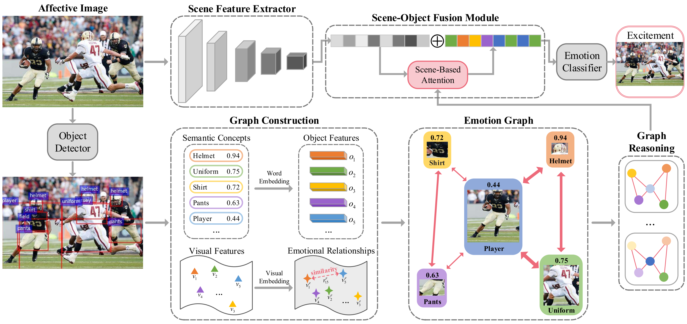

# SOLVER: Scene-Object Interrelated Visual Emotion Reasoning Network (TIP2021)

Jingyuan Yang; Xinbo Gao; Leida Li; Xiumei Wang; Jinshan Ding
### [Paper](https://ieeexplore.ieee.org/abstract/document/9580604)

Visual Emotion Analysis (VEA) aims at finding out how people feel emotionally towards different visual stimuli, which has attracted great attention recently with the prevalence of sharing images on social networks. Since human emotion involves a highly complex and abstract cognitive process, it is difficult to infer visual emotions directly from holistic or regional features in affective images. It has been demonstrated in psychology that visual emotions are evoked by the interactions between objects as well as the interactions between objects and scenes within an image. Inspired by this, we propose a novel Scene-Object interreLated Visual Emotion Reasoning network (SOLVER) to predict emotions from images. To mine the emotional relationships between distinct objects, we first build up an Emotion Graph based on semantic concepts and visual features. Then, we conduct reasoning on the Emotion Graph using Graph Convolutional Network (GCN), yielding emotion-enhanced object features. We also design a Scene-Object Fusion Module to integrate scenes and objects, which exploits scene features to guide the fusion process of object features with the proposed scene-based attention mechanism. Extensive experiments and comparisons are conducted on eight public visual emotion datasets, and the results demonstrate that the proposed SOLVER consistently outperforms the state-of-the-art methods by a large margin. Ablation studies verify the effectiveness of our method and visualizations prove its interpretability, which also bring new insight to explore the mysteries in VEA. Notably, we further discuss SOLVER on three other potential datasets with extended experiments, where we validate the robustness of our method and notice some limitations of it.

